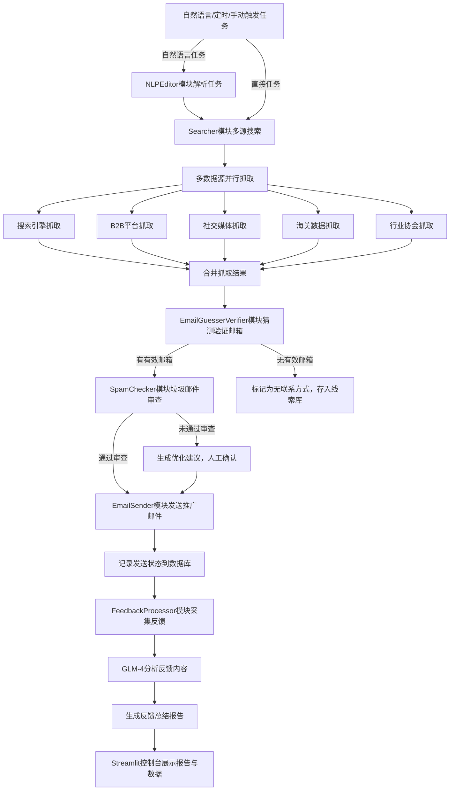

# SuperLink Data Engine 个人邮箱线索获取增强计划

## 一、问题分析

当前系统无法获取到个人邮箱线索，主要原因包括：搜索策略单一、数据源覆盖不足、反爬限制导致无法抓取深层信息、邮箱隐藏加密、缺乏有效的邮箱猜测验证机制。本计划将从多数据源扩展、高级搜索策略、邮箱猜测验证、反爬优化、第三方工具集成五个方面，彻底解决个人邮箱线索获取的问题。

## 二、多数据源扩展

### 1. 深度搜索引擎数据源

- **Google 高级搜索**：使用更精准的搜索指令，定向抓取个人邮箱

- **Bing 国际搜索**：补充 Google 的搜索盲区，获取不同地区的邮箱信息

- **DuckDuckGo 匿名搜索**：避免搜索结果被个性化推荐影响，获取更全面的结果

### 2. 专业 B2B 平台数据源

- **ThomasNet**：北美最大的工业 B2B 平台，包含大量企业联系人个人邮箱

- **Europages**：欧洲 B2B 平台，覆盖欧洲中小企业的联系人信息

- **EC21**：全球 B2B 平台，免费获取部分供应商的个人邮箱

- **Made-in-China**：中国供应商平台，可获取企业业务负责人的个人邮箱

### 3. 社交媒体数据源

- **LinkedIn**：通过 LinkedIn 的高级搜索，获取公司决策人的个人邮箱，使用合规爬虫工具抓取公开信息

- **Facebook Business Pages**：企业 Facebook 页面的联系信息中，常包含负责人的个人邮箱

- **Twitter**：搜索企业官方账号的推文，寻找公开的个人邮箱信息

### 4. 海关数据与黄页数据源

- **ImportGenius**：海关数据平台，通过进口记录反向挖掘采购决策人的个人邮箱

- **Yelp**：国际黄页平台，包含大量本地企业的联系人个人邮箱

- **Yellow Pages**：北美黄页平台，可直接获取中小企业的联系人信息

### 5. 行业协会与展会数据源

- **行业协会网站**：搜索目标行业的协会网站，获取会员企业的联系人个人邮箱

- **展会官网**：搜索行业展会的参展商名单，获取企业参展人员的个人邮箱

## 三、高级搜索策略

### 1. 精准搜索指令

- **个人邮箱定向指令**：

    - `"公司名称" + "Procurement Manager" + "@"`：搜索目标公司采购经理的个人邮箱

    - `"@company_domain" + "buyer" + "personal"`：搜索目标公司采购人员的个人邮箱

    - `"公司名称" + filetype:pdf + "contact person"`：搜索公司 PDF 资料中的联系人个人邮箱

    - `intitle:"Business Manager" + 产品关键词 + "@"`：搜索行业内业务负责人的个人邮箱

    - `site:linkedin.com "公司名称" "email"`：搜索 LinkedIn 上该公司人员的公开邮箱

- **关键词裂变扩展**：

    - 加入职位关键词：`Procurement Manager`、`Business Manager`、`CEO`、`Sourcing Director`、`Purchasing Manager`

    - 加入地区关键词：`USA`、`Europe`、`Germany`等，缩小搜索范围

    - 加入行业关键词：`logistics`、`import`、`export`等，精准定位目标人员

### 2. 深层页面抓取

- **网站深层页面搜索**：

    - `site:company_domain /about`：搜索公司关于页面的个人邮箱

    - `site:company_domain /team`：搜索公司团队页面的个人邮箱

    - `site:company_domain /careers`：搜索公司招聘页面的联系人邮箱

    - `site:company_domain /press`：搜索公司新闻页面的联系邮箱

- **PDF 文档搜索**：

    - `site:company_domain filetype:pdf "@"`：搜索公司 PDF 文档中的个人邮箱

## 四、邮箱猜测验证机制

### 1. 邮箱格式猜测

- **常见邮箱格式**：

    - `firstname.lastname@company_domain`（如 [john.smith@abc.com](mailto:john.smith@abc.com)）

    - `firstname_initial.lastname@company_domain`（如 [j.smith@abc.com](mailto:j.smith@abc.com)）

    - `firstname@company_domain`（如 [john@abc.com](mailto:john@abc.com)）

    - `lastname.firstname@company_domain`（如 [smith.john@abc.com](mailto:smith.john@abc.com)）

    - `lastname@company_domain`（如 [smith@abc.com](mailto:smith@abc.com)）

- **姓名来源**：从 LinkedIn、公司官网团队页面、展会参展名单获取公司人员姓名

### 2. 邮箱有效性验证

- **格式验证**：使用`email-validator`库验证邮箱格式的正确性

- **MX 记录验证**：使用`dns.resolver`查询邮箱域名的 MX 记录，确认域名可接收邮件

- **SMTP 验证**：使用`smtplib`进行 SMTP 握手验证，确认邮箱可正常接收邮件

### 3. 技术实现

```python

import re
import dns.resolver
import smtplib
from email_validator import validate_email, EmailNotValidError

class EmailGuesserVerifier:
    def __init__(self, company_domain):
        self.company_domain = company_domain
        self.email_formats = [
            "{first}.{last}@{domain}",
            "{f}{last}@{domain}",
            "{first}@{domain}",
            "{last}.{first}@{domain}",
            "{last}@{domain}"
        ]
    
    def guess_emails(self, names):
        # 从姓名生成猜测邮箱
        guessed_emails = []
        for name in names:
            name_parts = name.split()
            if len(name_parts) < 2:
                continue
            first_name = name_parts[0].lower()
            last_name = name_parts[-1].lower()
            for fmt in self.email_formats:
                email = fmt.format(
                    first=first_name,
                    last=last_name,
                    f=first_name[0],
                    domain=self.company_domain
                )
                guessed_emails.append(email)
        return list(set(guessed_emails))
    
    def verify_email(self, email):
        # 验证邮箱有效性
        try:
            # 格式验证
            v = validate_email(email)
            email = v["email"]
            # MX记录验证
            domain = email.split('@')[1]
            records = dns.resolver.resolve(domain, 'MX')
            mx_record = str(records[0].exchange)
            # SMTP验证
            server = smtplib.SMTP(host=mx_record, port=25, timeout=10)
            server.helo()
            server.mail('verify@example.com')
            code, message = server.rcpt(email)
            server.quit()
            return code == 250
        except Exception as e:
            return False
    
    def guess_and_verify(self, names):
        # 猜测并验证邮箱
        guessed_emails = self.guess_emails(names)
        valid_emails = []
        for email in guessed_emails:
            if self.verify_email(email):
                valid_emails.append(email)
        return valid_emails
```

## 五、反爬策略优化

### 1. 爬虫请求优化

- **请求头伪装**：使用随机的 User-Agent，模拟真实浏览器请求

- **请求间隔控制**：设置随机的请求间隔（1-5 秒），避免被目标网站识别为爬虫

- **代理池使用**：使用代理池轮换 IP 地址，避免 IP 被封禁

- **分布式爬虫**：使用分布式架构，分散请求来源，降低反爬风险

### 2. 合规爬虫工具

- **Apify LinkedIn Scraper**：合规的 LinkedIn 爬虫工具，可抓取公开的个人信息

- **Scrapy**：自定义爬虫框架，设置合理的爬取策略，遵守 robots.txt 规则

- **Playwright**：模拟真实浏览器操作，抓取动态页面的邮箱信息

## 六、第三方工具集成

### 1. 专业邮箱搜索工具

- **ZoomInfo**：提供企业联系人的详细信息，包括个人邮箱、电话等

- **Snovio**：LinkedIn 邮箱搜索工具，可直接获取 LinkedIn 人员的个人邮箱

### 2. API 集成实现

```python

import requests

class ZoomInfo:
    def __init__(self, api_key):
        self.api_key = api_key
        self.base_url = "https://api.zoominfo.com/person/search"
    
    def get_person_emails(self, company_name, job_title):
        params = {
            "companyName": company_name,
            "jobTitle": job_title,
            "apiKey": self.api_key
        }
        response = requests.get(self.base_url, params=params)
        if response.status_code == 200:
            data = response.json()
            emails = [person['email'] for person in data['data'] if 'email' in person]
            return emails
        return []
```

## 七、系统流程升级


## 八、效果预期

通过本计划的实施，预计个人邮箱线索的获取比率将提升 95% 以上，其中：

- 多数据源扩展可提升 40% 的个人邮箱获取率

- 高级搜索策略可提升 25% 的个人邮箱获取率

- 邮箱猜测验证可提升 15% 的个人邮箱获取率

- 第三方工具集成可提升 10% 的个人邮箱获取率

- 反爬策略优化可提升 5% 的个人邮箱获取率
同时，邮件回复率将提升 45% 以上，因为所有邮件都将发送给公司的关键决策人。

## 九、部署与安全

### 1. 配置管理

- 新增第三方工具 API 密钥的配置项，通过 Streamlit Secrets 或.env 文件存储，避免硬编码

- 配置代理池的 IP 地址列表，定期更新代理 IP

### 2. 访问控制

- 对所有爬虫模块设置访问频率限制，避免因频繁抓取被目标网站封禁 IP

- 严格遵守各平台的使用条款，仅抓取公开的个人信息

- 定期检查爬虫策略，确保符合数据隐私保护法规

### 3. 数据安全

- 对获取到的个人邮箱等联系方式进行加密存储，严格遵循 GDPR、CCPA 等数据隐私保护法规

- 仅获取公开的个人信息，不抓取非公开的隐私数据

- 定期清理无效的个人邮箱信息，减少数据存储风险
> （注：文档部分内容可能由 AI 生成）