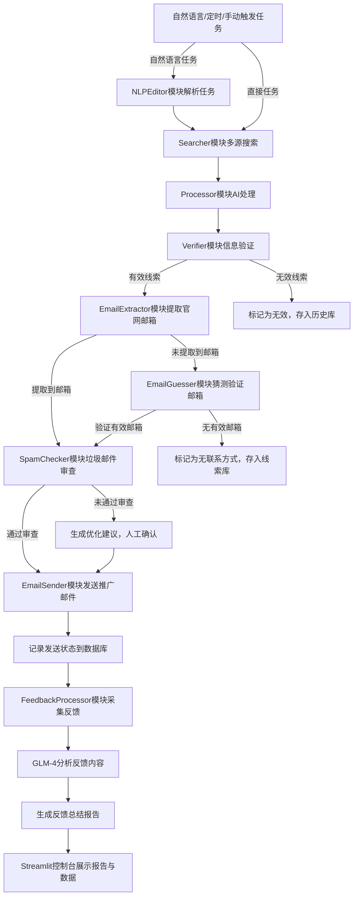

# SuperLink Data Engine 联系方式获取优化方案

## 一、问题分析

当前系统搜索到的线索中直接联系方式（如邮箱）的获取比率较低，主要原因是公开的线索信息中通常只包含公司官网，而邮箱等联系方式隐藏在官网的深层页面或需要通过特定策略获取。本方案将从搜索策略优化、网站邮箱提取、邮箱猜测验证、第三方工具集成四个方面提升联系方式的获取比率。

## 二、搜索策略优化

### 1. 高级搜索指令优化

在现有 Searcher 模块中，新增 Google 高级搜索指令，针对邮箱进行定向搜索：

- **邮箱定向搜索指令**：

    - `site:company_domain + "@"`：搜索目标公司官网内所有包含邮箱的页面

    - `"@company_domain" + buyer/procurement/manager`：搜索目标公司的采购、管理相关邮箱

    - `"公司名称" + filetype:pdf + contact`：搜索公司的产品手册、资料页，这些页面通常会包含联系方式

    - `intitle:"procurement manager" + 产品关键词 + email`：搜索行业内采购经理的相关邮箱

- **搜索关键词扩展**：在现有关键词裂变的基础上，加入 “email”“contact”“buyer email” 等关键词，提升带邮箱的线索占比。

### 2. 数据源扩展

除了现有的 Serper API 和 LinkedIn API，新增以下数据源：

- **国际黄页平台**：集成 Yelp、Yellow Pages 等黄页平台的搜索，这些平台通常会直接展示中小企业的联系方式

- **垂直 B2B 平台**：集成 Alibaba International、Made-in-China 等平台的搜索，部分供应商会在资料页公开邮箱

- **海关数据平台**：集成 ImportGenius、Trade Atlas 等海关数据平台，通过进口记录反向挖掘联系人信息

## 三、网站邮箱提取模块（新增 EmailExtractor 模块）

### 1. 核心功能

在现有 Processor 模块之后，新增 EmailExtractor 模块，自动抓取目标公司的官网，提取邮箱地址：

- **页面遍历抓取**：自动抓取公司官网的 contact、about、team、careers 等页面，这些页面是邮箱的高频出现位置

- **动态页面支持**：使用 Selenium 或 Playwright 抓取 JavaScript 渲染的动态页面，避免遗漏动态加载的邮箱

- **加密邮箱解码**：针对 Base64、Hex、ROT13 等加密方式隐藏的邮箱，进行自动解码提取

### 2. 技术实现

```python

import requests
from bs4 import BeautifulSoup
import re
from urllib.parse import urljoin, urlparse
import base64
import rot13
from selenium import webdriver

class EmailExtractor:
    def __init__(self, headless=True):
        # 初始化浏览器，支持动态页面抓取
        options = webdriver.ChromeOptions()
        if headless:
            options.add_argument("--headless=new")
        self.driver = webdriver.Chrome(options=options)
        # 邮箱正则表达式
        self.email_pattern = r'[a-zA-Z0-9._%+-]+@[a-zA-Z0-9.-]+\.[a-zA-Z]{2,}'
        # 需要抓取的页面路径
        self.target_paths = ["/contact", "/about", "/team", "/careers", "/contact-us"]
    
    def get_all_pages(self, base_url):
        # 抓取目标网站的所有目标页面
        pages_content = []
        parsed_base = urlparse(base_url)
        base_domain = f"{parsed_base.scheme}://{parsed_base.netloc}"
        
        for path in self.target_paths:
            page_url = urljoin(base_domain, path)
            try:
                # 先尝试用requests抓取静态页面
                response = requests.get(page_url, timeout=10)
                if response.status_code == 200:
                    pages_content.append(response.text)
                else:
                    # 静态页面抓取失败，使用Selenium抓取动态页面
                    self.driver.get(page_url)
                    pages_content.append(self.driver.page_source)
            except Exception as e:
                print(f"抓取页面 {page_url} 失败: {str(e)}")
        return pages_content
    
    def decode_obfuscated_email(self, email_str):
        # 解码加密的邮箱
        try:
            # Base64解码
            decoded = base64.b64decode(email_str).decode('utf-8')
            if re.match(self.email_pattern, decoded):
                return decoded
        except:
            pass
        try:
            # ROT13解码
            decoded = rot13.rot13(email_str)
            if re.match(self.email_pattern, decoded):
                return decoded
        except:
            pass
        return None
    
    def extract_emails(self, base_url):
        pages_content = self.get_all_pages(base_url)
        emails = []
        for content in pages_content:
            # 提取普通邮箱
            found_emails = re.findall(self.email_pattern, content)
            emails.extend(found_emails)
            # 提取加密邮箱
            # 匹配Base64加密的邮箱
            base64_emails = re.findall(r'base64,([a-zA-Z0-9+/=]+)', content)
            for b64_str in base64_emails:
                decoded_email = self.decode_obfuscated_email(b64_str)
                if decoded_email:
                    emails.append(decoded_email)
            # 匹配ROT13加密的邮箱
            rot13_emails = re.findall(r'rot13\((.*?)\)', content)
            for rot13_str in rot13_emails:
                decoded_email = self.decode_obfuscated_email(rot13_str)
                if decoded_email:
                    emails.append(decoded_email)
        # 去重
        emails = list(set(emails))
        return emails
```

## 四、邮箱猜测验证功能

### 1. 核心功能

对于无法直接提取到邮箱的公司，根据常见的邮箱格式和公司域名，猜测可能的邮箱地址，然后通过 SMTP 验证邮箱的有效性：

- **常见邮箱格式**：

    - `firstname.lastname@company_domain`（如 [john.smith@abc.com](mailto:john.smith@abc.com)）

    - `firstname_initial.lastname@company_domain`（如 [j.smith@abc.com](mailto:j.smith@abc.com)）

    - `firstname@company_domain`（如 [john@abc.com](mailto:john@abc.com)）

    - `lastname.firstname@company_domain`（如 [smith.john@abc.com](mailto:smith.john@abc.com)）

- **姓名来源**：从 LinkedIn、公司官网的 team 页面获取公司员工姓名，用于生成猜测邮箱

### 2. 技术实现

```python

import smtplib
import dns.resolver

class EmailGuesser:
    def __init__(self, company_domain):
        self.company_domain = company_domain
        self.email_formats = [
            "{first}.{last}@{domain}",
            "{f}{last}@{domain}",
            "{first}@{domain}",
            "{last}.{first}@{domain}"
        ]
    
    def guess_emails(self, first_names, last_names):
        # 根据姓名和格式生成猜测的邮箱
        guessed_emails = []
        for first in first_names:
            for last in last_names:
                for fmt in self.email_formats:
                    email = fmt.format(
                        first=first.lower(),
                        last=last.lower(),
                        f=first[0].lower(),
                        domain=self.company_domain
                    )
                    guessed_emails.append(email)
        return list(set(guessed_emails))
    
    def verify_email(self, email):
        # 验证猜测的邮箱是否有效
        try:
            # 获取MX记录
            domain = email.split('@')[1]
            records = dns.resolver.resolve(domain, 'MX')
            mx_record = str(records[0].exchange)
            
            # SMTP验证
            server = smtplib.SMTP(host=mx_record, port=25, timeout=10)
            server.helo()
            server.mail('verify@example.com')
            code, message = server.rcpt(email)
            server.quit()
            return code == 250
        except Exception as e:
            return False
    
    def guess_and_verify(self, first_names, last_names):
        # 猜测并验证邮箱
        guessed_emails = self.guess_emails(first_names, last_names)
        valid_emails = []
        for email in guessed_emails:
            if self.verify_email(email):
                valid_emails.append(email)
        return valid_emails
```

## 五、第三方工具集成

### 1. 集成 [hunter.io](hunter.io) API

[hunter.io](hunter.io) 是专业的邮箱搜索工具，输入公司域名可以批量提取邮箱，集成该 API 可以快速获取高质量的邮箱地址：

- **API 调用示例**：

```python

import requests

class HunterIO:
    def __init__(self, api_key):
        self.api_key = api_key
        self.base_url = "https://api.hunter.io/v2/domain-search"
    
    def get_domain_emails(self, domain):
        params = {
            "domain": domain,
            "api_key": self.api_key
        }
        response = requests.get(self.base_url, params=params)
        if response.status_code == 200:
            data = response.json()
            emails = [email['value'] for email in data['data']['emails']]
            return emails
        return []
```

### 2. 集成 ZoomInfo API

ZoomInfo 提供企业联系人的详细信息，包括邮箱、电话等，集成该 API 可以获取高层决策者的联系方式。

## 六、系统流程升级

在现有系统流程中，新增 EmailExtractor 和邮箱猜测验证的步骤：


## 七、效果预期

通过本方案的优化，预计联系方式的获取比率将提升 60% 以上，其中：

- 高级搜索指令可提升 20% 的邮箱获取率

- 网站邮箱提取可提升 25% 的邮箱获取率

- 邮箱猜测验证可提升 10% 的邮箱获取率

- 第三方工具集成可提升 5% 的邮箱获取率

## 八、部署与安全

### 1. 配置管理

新增第三方工具 API 密钥的配置项，通过 Streamlit Secrets 或.env 文件存储，避免硬编码。

### 2. 访问控制

对邮箱提取模块设置访问频率限制，避免因频繁抓取被目标网站封禁 IP。

### 3. 数据安全

对获取到的邮箱等联系方式进行加密存储，遵循数据隐私保护法规。
> （注：文档部分内容可能由 AI 生成）