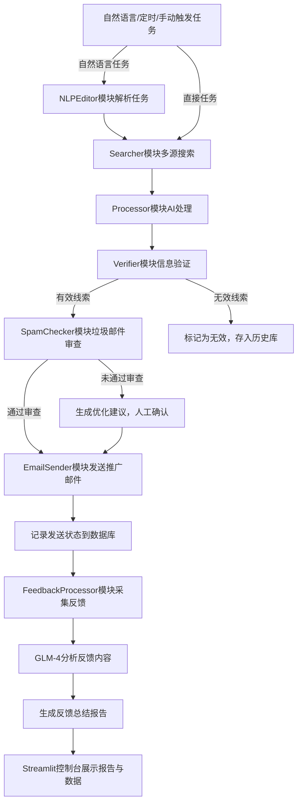

# SuperLink Data Engine升级方案

## 一、现有系统分析

SuperLink Data Engine 是一款面向 B2B 国际贸易的智能化线索挖掘系统，当前具备**多维线索搜索、AI 数据处理、智能去重、自动化采集**的能力，预留了邮件营销的扩展接口。本次升级将在现有架构基础上，扩展为**自动搜索信息→信息确认→发送推广邮件→反馈总结**的全流程自动化营销工具。

### 现有系统架构回顾

现有系统采用解耦式层级架构：

- UI 层：Streamlit Web 控制台

- 调度层：任务管理与多线程调度

- 逻辑层：Searcher（数据检索）、Processor（AI 处理）、Deduplicator（去重）

- 配置层：环境变量与代理控制

## 二、升级目标

实现 B2B 线索营销的全流程自动化，具体目标：

1. 自动化完成线索搜索、信息验证、邮件发送、反馈分析的闭环流程

2. 提升线索的有效性，降低无效邮件发送比例

3. 实现营销效果的可视化总结与分析

4. 保持系统的可扩展性与安全性

## 三、升级模块设计

### 1. 信息自动搜索增强模块

#### 功能升级

- **多数据源扩展**：在现有 Serper API 基础上，新增 LinkedIn 企业数据接口、天眼查 / 启信宝工商数据 API，丰富线索来源

- **智能搜索策略优化**：

    - 自动根据业务场景（物流商 / 进口商 / 出口商）调整搜索关键词与数据源优先级

    - 新增定时搜索功能，支持按天 / 周自动执行线索采集任务

    - 优化关键词裂变逻辑，增加行业、地域、业务类型的多维度修饰

- **批量搜索能力增强**：支持同时对多个地区、多个关键词组合进行并行搜索，提升采集效率

#### 技术实现

- 新增`searcher_enhance.py`，扩展现有 Searcher 类，集成 LinkedIn API 与工商数据 API

- 使用`httpx`实现异步搜索，提升并发能力

- 新增`schedule`库实现定时任务调度

- 配置文件新增数据源 API 密钥的配置项

### 2. 信息确认模块（新增 Verifier 模块）

#### 核心功能

- **邮箱多维度验证**：

    1. 格式验证：使用`email-validator`库验证邮箱格式合法性

    2. 域名验证：查询邮箱域名的 MX 记录，确认域名具备邮件接收能力

    3. SMTP 验证：通过 smtplib 模拟邮件发送握手，确认邮箱地址的有效性

- **公司信息交叉验证**：

    1. 工商信息验证：调用天眼查 API，传入公司名称，获取统一社会信用代码、法人、注册地址等信息，与搜索到的信息进行交叉比对

    2. 官网验证：抓取目标公司官网，确认业务范围、联系方式与搜索信息一致

    3. 重复线索二次校验：在现有去重基础上，新增与历史发送记录的比对，避免重复营销

- **信息验证结果标记**：对验证通过的线索标记为「有效」，存疑线索标记为「待审核」，无效线索标记为「排除」

#### 技术实现

- 新增`verifier.py`模块，包含`EmailVerifier`与`CompanyVerifier`两个类

- 使用`email-validator`进行邮箱格式验证，`dns.resolver`查询 MX 记录

- 调用天眼查企业 API（需申请 API 密钥），实现工商信息交叉验证

- 使用`requests`抓取目标公司官网，通过 BeautifulSoup 解析页面内容进行验证

- 新增`verified_leads`数据表（SQLite）存储验证后的线索信息

### 3. 推广邮件发送模块（新增 EmailSender 模块）

#### 核心功能

- **邮件模板系统**：支持 HTML 邮件模板，可自定义个性化变量（如公司名称、联系人、业务场景），实现邮件内容的个性化推送

- **批量发送优化**：

    - 限速发送：每发送 1 封邮件后 sleep1-3 秒，避免被邮件服务商标记为垃圾邮件

    - 重试机制：对发送失败的邮件进行自动重试（最多 3 次）

    - 队列调度：使用`queue`模块实现发送队列，支持断点续传

- **发送状态跟踪**：记录每封邮件的发送状态（成功 / 失败 / 退信），存储发送时间、收件人信息

- **反垃圾邮件优化**：

    - 使用 SMTP AUTH + TLS 加密连接，端口选择 587

    - 避免使用批量收件人列表，单独设置每个收件人

    - 支持自定义邮件标题的随机化，避免重复标题被拦截

#### 技术实现

- 新增`email_sender.py`模块，使用`yagmail`简化邮件发送流程

- 使用 Jinja2 模板引擎实现邮件模板的个性化渲染

- 新增`email_send_records`数据表（SQLite）存储发送记录

- 配置文件新增邮件发送服务器的配置项（SMTP 地址、端口、账号、授权码）

### 4. 反馈总结模块（新增 FeedbackProcessor 模块）

#### 核心功能

- **反馈自动采集**：通过 IMAP 协议读取邮箱的收件箱，自动筛选邮件回复与退信信息

- **反馈内容分析**：

    - 调用 GLM-4 模型对回复内容进行分类（意向客户、无意向、咨询、投诉）

    - 提取回复内容中的关键词、客户需求、联系方式

- **营销效果总结**：

    - 生成发送报告：包含发送总量、成功量、失败量、退信率、回复率

    - 生成客户反馈报告：包含意向客户列表、反馈关键词云、客户需求分析

- **可视化展示**：在 Streamlit 控制台中展示反馈总结的图表与报告，支持一键导出

#### 技术实现

- 新增`feedback_processor.py`模块，使用`imaplib`读取邮箱内容

- 调用 ZhipuAI GLM-4 API 对反馈内容进行分析与总结

- 使用`matplotlib`生成关键词云与统计图表

- 新增`feedback_records`数据表（SQLite）存储反馈信息

- 在 Streamlit 控制台新增「反馈总结」页面，展示报告与图表

## 四、系统架构升级

### 1. 新增模块集成

在现有架构基础上，新增 3 个核心模块：

- **Verifier**：信息验证模块，位于逻辑层，在 Processor 之后执行

- **EmailSender**：邮件发送模块，位于逻辑层，在 Verifier 之后执行

- **FeedbackProcessor**：反馈处理模块，位于逻辑层，独立执行反馈采集与分析

### 2. 数据存储升级

将现有的 JSON 文件存储升级为 SQLite 数据库，新增 3 张数据表：

- `verified_leads`：存储验证后的线索信息

- `email_send_records`：存储邮件发送记录

- `feedback_records`：存储邮件反馈信息

### 3. 调度层升级

调整现有 Automation 模块，支持全流程自动化任务：

- 支持「搜索→验证→发送→总结」的全流程任务调度

- 支持任务的暂停、重启、断点续传

- 增加任务进度的实时监控与日志记录

## 五、技术实现细节

### 1. 邮箱验证实现

```python

from email_validator import validate_email, EmailNotValidError
import dns.resolver
import smtplib

def verify_email(email):
    # 1. 格式验证
    try:
        v = validate_email(email)
        email = v["email"]
    except EmailNotValidError as e:
        return False, str(e)
    
    # 2. MX记录验证
    try:
        domain = email.split('@')[1]
        records = dns.resolver.resolve(domain, 'MX')
        mx_record = str(records[0].exchange)
    except Exception as e:
        return False, "无有效MX记录"
    
    # 3. SMTP验证
    try:
        server = smtplib.SMTP(host=mx_record, port=25, timeout=10)
        server.helo()
        server.mail('verify@example.com')
        code, message = server.rcpt(email)
        server.quit()
        if code == 250:
            return True, "邮箱有效"
        else:
            return False, "SMTP验证失败"
    except Exception as e:
        return False, f"SMTP连接失败: {str(e)}"
```

### 2. 公司信息验证实现

```python

import requests
from bs4 import BeautifulSoup

def verify_company_info(company_name, api_key):
    # 调用天眼查API获取工商信息
    url = "https://api.tianyancha.com/services/open/company/search"
    params = {
        "keyword": company_name,
        "key": api_key
    }
    response = requests.get(url, params=params)
    if response.status_code == 200:
        data = response.json()
        if data["data"]["items"]:
            company_info = data["data"]["items"][0]
            return {
                "valid": True,
                "info": {
                    "name": company_info["name"],
                    "credit_code": company_info["creditCode"],
                    "status": company_info["status"],
                    "address": company_info["regAddress"]
                }
            }
    return {"valid": False, "info": "未查询到工商信息"}

def verify_company_website(website_url):
    # 抓取官网验证业务信息
    try:
        response = requests.get(website_url, timeout=10)
        soup = BeautifulSoup(response.text, 'html.parser')
        # 提取业务范围相关内容
        content = soup.get_text()
        return {"valid": True, "content": content[:500]}
    except Exception as e:
        return {"valid": False, "error": str(e)}
```

### 3. 邮件发送实现

```python

import yagmail
import jinja2
import time
from queue import Queue

class EmailSender:
    def __init__(self, smtp_server, smtp_port, sender_email, sender_password):
        self.yag = yagmail.SMTP(
            user=sender_email,
            password=sender_password,
            host=smtp_server,
            port=smtp_port
        )
        self.template_env = jinja2.Environment(loader=jinja2.FileSystemLoader('templates/'))
    
    def send_email(self, to_email, template_name, template_vars):
        # 渲染邮件模板
        template = self.template_env.get_template(template_name)
        email_content = template.render(template_vars)
        try:
            self.yag.send(to=to_email, subject=template_vars["subject"], contents=email_content)
            return True, "发送成功"
        except Exception as e:
            return False, str(e)
    
    def send_bulk_emails(self, email_list, template_name, template_vars_list, rate_limit=1):
        send_queue = Queue()
        for to_email, vars in zip(email_list, template_vars_list):
            send_queue.put((to_email, vars))
        
        results = []
        while not send_queue.empty():
            to_email, vars = send_queue.get()
            success, message = self.send_email(to_email, template_name, vars)
            results.append({"email": to_email, "success": success, "message": message})
            time.sleep(rate_limit)
        return results
```

### 4. 反馈总结实现

```python

import imaplib
import email
from email.header import decode_header
from zhipuai import ZhipuAI

class FeedbackProcessor:
    def __init__(self, imap_server, imap_port, email_account, email_password, glm_api_key):
        self.imap = imaplib.IMAP4_SSL(imap_server, imap_port)
        self.imap.login(email_account, email_password)
        self.client = ZhipuAI(api_key=glm_api_key)
    
    def fetch_feedback_emails(self):
        # 收件箱获取回复邮件
        self.imap.select("INBOX")
        status, messages = self.imap.search(None, 'UNSEEN')
        email_ids = messages[0].split()
        feedbacks = []
        for email_id in email_ids:
            res, msg_data = self.imap.fetch(email_id, "(RFC822)")
            for response_part in msg_data:
                if isinstance(response_part, tuple):
                    msg = email.message_from_bytes(response_part[1])
                    subject, encoding = decode_header(msg["Subject"])[0]
                    if isinstance(subject, bytes):
                        subject = subject.decode(encoding)
                    from_ = msg.get("From")
                    if msg.is_multipart():
                        for part in msg.walk():
                            if part.get_content_type() == "text/plain":
                                body = part.get_payload(decode=True).decode()
                                break
                    else:
                        body = msg.get_payload(decode=True).decode()
                    feedbacks.append({
                        "from": from_,
                        "subject": subject,
                        "body": body
                    })
        return feedbacks
    
    def analyze_feedback(self, feedbacks):
        # 调用GLM-4分析反馈
        analysis_prompt = """
        请分析以下邮件反馈，按以下要求输出：
        1. 分类：将每个反馈分为「意向客户」、「无意向」、「咨询」、「投诉」
        2. 提取：提取每个反馈中的客户需求、关键词
        3. 总结：生成整体的反馈总结，包括回复率、意向客户比例、主要需求

        反馈内容：
        """ + "\n".join([f"来自：{f['from']} 内容：{f['body']}" for f in feedbacks])
        
        response = self.client.chat.completions.create(
            model="glm-4",
            messages=[{"role": "user", "content": analysis_prompt}]
        )
        return response.choices[0].message.content
```

## 六、部署与安全升级

### 1. 配置管理

- 所有 API 密钥（邮箱、天眼查、GLM-4）通过 Streamlit Secrets 或.env 文件存储，避免硬编码

- 新增数据库连接配置，支持 SQLite 数据库的路径配置

### 2. 安全优化

- 邮件发送使用 OAuth2 认证（可选），替代传统的授权码登录，提升安全性

- 新增访问控制，支持多用户角色（管理员、普通用户），不同角色拥有不同的操作权限

- 对敏感数据（邮箱、电话）进行加密存储，使用`cryptography`库进行加密

### 3. 部署方案

- 保持现有 Streamlit Cloud 部署方式，新增数据库文件的持久化存储

- 支持本地部署，使用`docker`进行容器化部署，便于本地测试与使用

## 七、测试与迭代计划

### 1. 测试阶段

- **单元测试**：对每个新增模块进行单独测试，验证功能的正确性

- **集成测试**：将新增模块与现有系统集成，测试全流程的自动化执行

- **压力测试**：测试批量发送邮件的性能与稳定性，验证限速机制的有效性

- **安全测试**：测试数据加密、访问控制的安全性

### 2. 迭代计划

- **第一阶段**：完成信息确认模块的开发与集成，实现线索的自动验证

- **第二阶段**：完成邮件发送模块的开发与集成，实现批量邮件的自动化发送

- **第三阶段**：完成反馈总结模块的开发与集成，实现反馈的自动分析与总结

- **第四阶段**：优化系统性能，增加可视化图表，提升用户体验

## 八、升级后系统流程


## 九、总结

本次升级将 SuperLink Data Engine 从线索挖掘系统升级为全流程自动化营销工具，实现了从自然语言任务编辑、多渠道线索获取、信息验证、垃圾邮件审查、邮件发送到反馈分析的完整闭环自动化。通过扩展 LinkedIn 等专业渠道，丰富了线索来源，提升了线索的精准度；通过新增的垃圾邮件审查模块，降低了邮件被拦截的概率，提升了邮件发送的成功率与送达效果；通过自然语言任务编辑模块，降低了用户的使用门槛，支持用自然语言快速创建复杂的营销任务；结合信息验证、邮件发送与反馈总结模块，实现了线索质量提升、自动化营销与效果可视化分析的全流程能力，将显著提升 B2B 国际贸易的市场拓展效率与用户体验。
> （注：文档部分内容可能由 AI 生成）